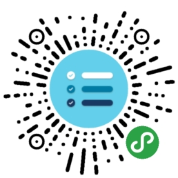
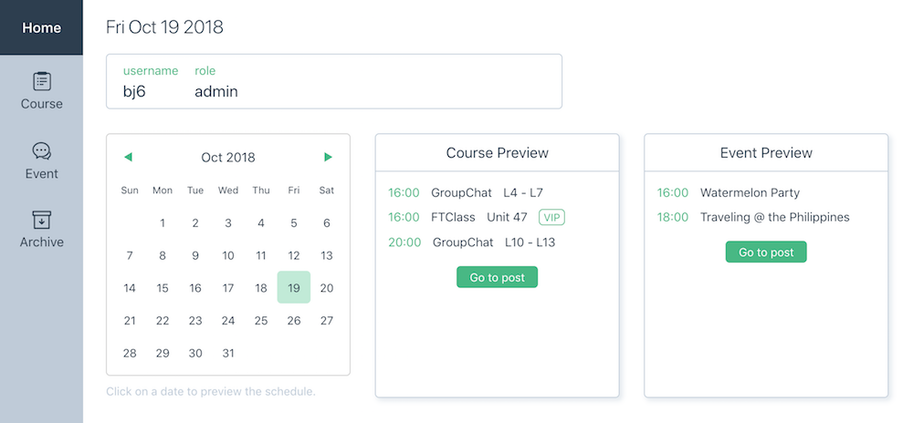
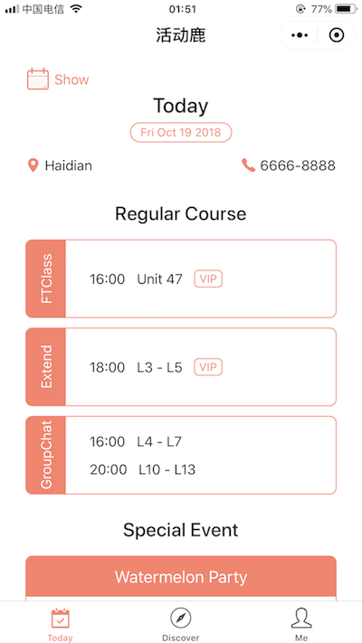

# 活动鹿 eventdeer

## 1. 功能简介

### 1.1 发布端 (web)

查看：http://eventdeer.surge.sh (用户名/密码见简历)

用户类型：课程发布者

结构和功能
- Home
    - 根据日历查看已发布课程
- Course/Event
    - 已发布课程信息列表
    - 发布新课程，修改或删除已有课程
- Archive
    - 查看归档课程

### 1.2 展示端 (小程序)

查看：扫上方小程序码或在微信中搜索“活动鹿”

用户类型：学员

结构和功能
- Tab1: Today
    - 当天课程安排，或根据日历查看其他日期的课程
    - 把课程安排分享给好友
- Tab2: Discover
    - 精彩活动预告，点击相应卡片查看活动详情 (图片和文字介绍)
    - 把活动详情分享给好友或保存为图片
- Tab3: Me
    - 登录/登出
    - 使用反馈

## 2. 业务需求

某英语教学机构每天需要向学生发布课程表，根据特点可以分为两个类别的课程：

| 类别名称 | 排课途径 | 是否需要预订 | 级别要求 |
| --- | --- | --- | --- |
| Course | 官方核心课程 | 在官方系统中订课 | 严格对应所在级别 |
| Event | A 中心自行安排的课程或活动 | 多数不需要订课，少数需要线下预约 | 宽松，通常对应一个级别范围 |

工作人员目前发布课程的方式是，把课程信息制作为表格图片通过微信群发给学员，或者发布在朋友圈。

这种发布方式的缺点有：
- 对学员来说
    - 不方便收集和查看课程信息；
    - 无法立刻得到最新的课程信息。
- 对工作人员来说
    - 粘贴信息和制作图片是大量的重复劳动；
    - 图片一经发布无法更新和修改；
    - 已发布的课程散乱无条理，不方便统计和回顾。

但是也有优点：将图片发送给学生，是一种提醒和激励，可以督促学生出席更多课程。

工作人员在网页端发布课程，学生通过小程序查看课程，可以有效改善以上缺点，提高双方的效率。
同时，原有的发布方式也可以保留，作为一种辅助手段。

## 3. 技术实现 (work in progress)

### 3.1 发布端

前端框架 Vue.js

[基于 Vue 的日历组件](https://github.com/charliekassel/vuejs-datepicker)

### 3.2 展示端

微信小程序

[基于小程序的日历组件](https://github.com/treadpit/wx_calendar)

### 3.3 后端

LeanCloud